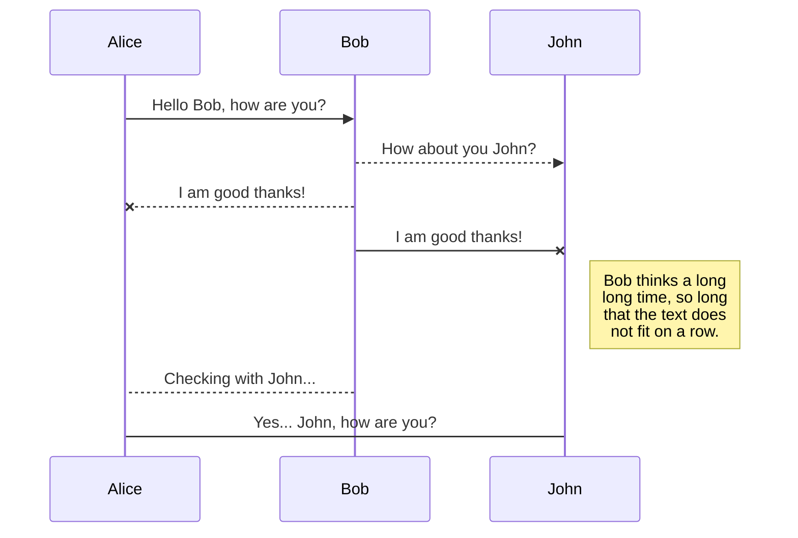
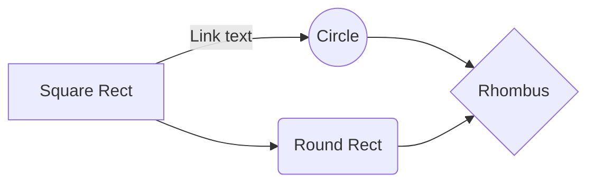

# 深入浅出策略梯度(Policy Gradient)

Alpha GO 战胜人类棋手标志着机器学习特别是强化学习正在成为解决实际复杂问题的有力武器，由于强化学习自身的特点，目前在很多复杂场景下，例如自动驾驶，机器人等复杂自动控制领域发挥着越来越带的作用。本文旨在介绍强化学习中梯度策略（PG）的基本原理，相关概念，并着重介绍作者在学习PG过程中遇到的一些难点如理解score function和实现技术。

# 相关概念

## 强化学习
监督式学习由于依赖标记过的数据来训练计算机，本质上是有人来教计算机的学习方法，而强化学习是计算机独立自我学习解决复杂问题的一类方法，通过不断地与系统交互并优化反馈来学习。
Typically, a RL setup is composed of two components, an agent and an environment.
强化学习一般包含两部分：agent和环境

Reinforcement Learning Illustration ([https://i.stack.imgur.com/eoeSq.png](https://i.stack.imgur.com/eoeSq.png))

Then environment refers to the object that the agent is acting on (e.g. the game itself in the Atari game), while the agent represents the RL algorithm. The environment starts by sending a state to the agent, which then based on its knowledge to take an action in response to that state. After that, the environment send a pair of next state and reward back to the agent. The agent will update its knowledge with the reward returned by the environment to evaluate its last action. The loop keeps going on until the environment sends a terminal state, which ends to episode.

Most of the RL algorithms follow this pattern. In the following paragraphs, I will briefly talk about some terms used in RL to facilitate our discussion in the next section.
#### Definition

1.  动作 (A): All the possible moves that the agent can take
2.  状态 (S): Current situation returned by the environment.
3.  奖励 (R): An immediate return send back from the environment to evaluate the last action.
4.  策略 (π): The strategy that the agent employs to determine next action based on the current state.
5.  Value (V): The expected long-term return with discount, as opposed to the short-term reward R. _Vπ(s)_  is defined as the expected long-term return of the current state sunder policy π.
6.  Q-value or action-value (Q): Q-value is similar to Value, except that it takes an extra parameter, the current action  _a_.  _Qπ(s, a)_  refers to the long-term return of the current state  _s_, taking action  _a_  under policy π.
举例解释ASR$\pi$
I Discrete action space: network outputs vector of probabilities
I Continuous action space: network outputs mean and diagonal covariance of
Gaussian
DQN is a form of Q-learning with function approximation (using a neural network), which means it tries to learn a state-action value function Q (given by a neural network in DQN) by minimizing temporal-difference errors, i.e. trying to make the value  Q(s,a)Q(s,a)  close to *r+γmaxa′Q(s′,a′)r+γmaxa′Q(s′,a′)*  after observing a transition  (s,a,r,s′)(s,a,r,s′), where the actions can be chosen arbitrarily (the algorithm is  _off-policy_), typically using a greedy or epsilon-greedy policy based on the current Q function.

In contrast, policy gradient methods try to learn a policy function directly (instead of a Q function), and are typically  _on-policy_, meaning you need to learn from trajectories generated by the current policy. One way to learn an approximation policy is by directly maximizing expected reward using gradient methods, hence "policy gradient" (the gradient of the expected reward w.r.t. the parameters of the policy can be obtained via the policy gradient theorem[\[1\]](https://www.quora.com/What-is-difference-between-DQN-and-Policy-Gradient-methods#KoFXD)  for stochastic policies, or the deterministic policy gradient theorem[\[2\]](https://www.quora.com/What-is-difference-between-DQN-and-Policy-Gradient-methods#pbpRc) for deterministic policies).
## Markov Decision Process (MDP)

# 策略梯度（PG）
## PG的基本原理
DQN可以直接计算奖励从而可以得到最优解，这听上去很不错，但这种确定性(deterministic)的方法恰恰无法处理一些博弈问题，比如玩100把石头剪刀布的游戏，最好的解法是随机的使用石头、剪刀和布并尽量保证这三种手势出现的概率一样，因为任何一种手势的概率高于其他手势都会被对手注意到并使用相应的手势赢得游戏。 再比如下图这个例子：
石头剪刀布的例子-stochastic

采用DQN的方法在确定的状态下将得到确定的reward，因此在使用DQN方法决定灰色方格的下一步（左或右）将必然会导致bad result。事实上很多实际的都有类似的特征，即

~~由此看来，我们需要一种非确定性的方法来~~
另外，有限的状态数量也是使用DQN的一个大问题，因为基于值的方法需要保存状态表（所有状态-动作的对应关系），因此很多现实问题（例如机器人控制和自动驾驶都是连续动作空间），都因为巨量的状态而无法计算。
那么如何解决上面的两个问题呢？有没有一种方法能在确定的状态下得到不同的动作呢？又有什么方法能避免维护庞大的状态表呢？
简单来说，PG则采取了随机（stochastic）的方式解决了上述2个问题。首先随机能提供非确定的结果，但这种非确定的结果并不是完全的随机而是服从某种概率分布的随机，PG不计算reward而是以直接使用策略选择action，这样就避免了因为计算奖励而维护状态表。 
那么PG的学习到底是怎样的呢？在解释这个过程之前先介绍几个概念：
对象系统：就是PG的学习对象，这个对象即可以是一个系统，比如汽车或一个游戏，也可以是一个对手，比如势头剪刀布的游戏对手或者一个职业的围棋手。
~~MDP:Reward function~~
**Policy策略** $\pi_\theta(a|s)$ 表示在状态$s$和参数$\theta$条件下发生动作$a$的概率
**Episode轮次**: 表示从起始状态开始使用某种策略产生动作与对象系统交互，直到某个终结状态结束。比如在围棋游戏中的一个轮次就是从棋盘中的第一个落子开始直到对弈分出胜负，或者自动驾驶的轮次指从汽车启动一直到顺利抵达指定的目的地，当然撞车或者开进水塘也是种不理想的终结状态。
**Trajectory轨迹** $\tau$ 表示在PG一个轮次的学习中状态$s$，动作$a$和奖励$r$的顺序排列
$$
\tau = (s_0, a_0, r_0, s_1, a_1, r_1, ... , s_t, a_t, r_t)
$$
由于策略产生的是非确定的动作，同一个策略在多个轮次可以产生多个不同的轨迹，~~因此在实现中对每个策略会求多个轮次的平均值~~

PG的学习是一个策略的优化过程，最开始随机的生成一个策略，当然这个策略对对象系统一无所知，所以用这个策略产生的动作会从对象系统那里很可能会得到一个负面奖励，这个过程就好像我们的自动驾驶策略在面对笔直的路面而产生右转的动作导致汽车撞上路边的行人这样的严重后果。为了更好的驾驶汽车PG需要不断的改变策略从而获得更高的轮次奖励（安全快速的到达目的地），PG在一轮的学习中使用同一个策略直到该轮结束，通过梯度上升改变策略并开始下一轮学习，如此往复直到轮次累计奖励不再增长停止。   ~~一个使得action的选择服从一定的概率分布，通过使用这个策略完成所有交互，这就把一个复杂的实际问题转化成了概率优化问题~~

## PG的目标函数
根据上述PG的基本原理，我们可以把PG的目标形式化的描述为以下表达式

$$
J(\theta) = argmax_\theta \mathbb E[r_0+r_1+r_2+...+r_t|\pi_\theta]  
$$
其中$\mathbb E[r_0+r_1+r_2+...+r_t|\pi_\theta]$表示在策略$\pi_\theta$条件下一轮交互（$0$到$t$步）中的累计奖励的期望值，这里是期望而不是确定值是因为每一步的奖励是根据策略得到的期望值而不是确定值。由于$r_i$可以由$r(\tau_{i-1})$计算得到，因此可以把累计奖励的期望值写成如下：

$$
J(\theta) = \mathbb E_{\tau\sim p_\theta(\tau)}[\sum_t r(\tau)] \approx \frac {1}{N}\sum_i\sum_t r(s_{i,t}, a_{i,t})
$$
我们把单个轮次的累计奖励作为PG的目标函数$J(\theta)$，则PG的目标就是确定构成策略的参数$\theta$使得$J(\theta)$取得最大的期望值

$$
\theta ^* = argmax J(\theta)
$$
图片trajectory.

现在PG的学习就变成了一个对$J(\theta)$求最大值的问题，和监督式学习中使用的梯度下降(gradient descent)求损失函数(loss function)的最小值类似，PG中使用梯度上升(gradient ascent)来更新$\theta$。
根据期望值的数学定义，

$$
J(\theta) = \mathbb E_{r\sim p_\theta(\tau)} [\sum r_\tau]= \int_\tau r(\tau)\pi_\theta(\tau) d\tau
$$
对这个积分表达式求导数，
$$
\nabla_\theta J(\theta) =  \nabla_\theta \int_\tau r(\tau)\pi_\theta(\tau) d\tau= \int_\tau r(\tau)\nabla_\theta \pi_\theta(\tau) d\tau
$$
由于$\pi_\theta($
## Score function的由来

## PG的改进\t

# 总结
----------

----------

The file explorer is accessible using the button in left corner of the navigation bar. You can create a new file by clicking the **New file** button in the file explorer. You can also create folders by clicking the **New folder** button.

## Switch to another file

All your files are listed in the file explorer. You can switch from one to another by clicking a file in the list.

## Rename a file

You can rename the current file by clicking the file name in the navigation bar or by clicking the **Rename** button in the file explorer.

## Delete a file

You can delete the current file by clicking the **Remove** button in the file explorer. The file will be moved into the **Trash** folder and automatically deleted after 7 days of inactivity.

## Export a file

You can export the current file by clicking **Export to disk** in the menu. You can choose to export the file as plain Markdown, as HTML using a Handlebars template or as a PDF.

# Synchronization

Synchronization is one of the biggest features of StackEdit. It enables you to synchronize any file in your workspace with other files stored in your **Google Drive**, your **Dropbox** and your **GitHub** accounts. This allows you to keep writing on other devices, collaborate with people you share the file with, integrate easily into your workflow... The synchronization mechanism takes place every minute in the background, downloading, merging, and uploading file modifications.

There are two types of synchronization and they can complement each other:

- The workspace synchronization will sync all your files, folders and settings automatically. This will allow you to fetch your workspace on any other device.
	> To start syncing your workspace, just sign in with Google in the menu.

- The file synchronization will keep one file of the workspace synced with one or multiple files in **Google Drive**, **Dropbox** or **GitHub**.
	> Before starting to sync files, you must link an account in the **Synchronize** sub-menu.

## Open a file

You can open a file from **Google Drive**, **Dropbox** or **GitHub** by opening the **Synchronize** sub-menu and clicking **Open from**. Once opened in the workspace, any modification in the file will be automatically synced.

## Save a file

You can save any file of the workspace to **Google Drive**, **Dropbox** or **GitHub** by opening the **Synchronize** sub-menu and clicking **Save on**. Even if a file in the workspace is already synced, you can save it to another location. StackEdit can sync one file with multiple locations and accounts.

## Synchronize a file

Once your file is linked to a synchronized location, StackEdit will periodically synchronize it by downloading/uploading any modification. A merge will be performed if necessary and conflicts will be resolved.

If you just have modified your file and you want to force syncing, click the **Synchronize now** button in the navigation bar.

> **Note:** The **Synchronize now** button is disabled if you have no file to synchronize.

## Manage file synchronization

Since one file can be synced with multiple locations, you can list and manage synchronized locations by clicking **File synchronization** in the **Synchronize** sub-menu. This allows you to list and remove synchronized locations that are linked to your file.

# Publication

Publishing in StackEdit makes it simple for you to publish online your files. Once you're happy with a file, you can publish it to different hosting platforms like **Blogger**, **Dropbox**, **Gist**, **GitHub**, **Google Drive**, **WordPress** and **Zendesk**. With [Handlebars templates](http://handlebarsjs.com/), you have full control over what you export.

> Before starting to publish, you must link an account in the **Publish** sub-menu.

## Publish a File

You can publish your file by opening the **Publish** sub-menu and by clicking **Publish to**. For some locations, you can choose between the following formats:

- Markdown: publish the Markdown text on a website that can interpret it (**GitHub** for instance),
- HTML: publish the file converted to HTML via a Handlebars template (on a blog for example).

## Update a publication

After publishing, StackEdit keeps your file linked to that publication which makes it easy for you to re-publish it. Once you have modified your file and you want to update your publication, click on the **Publish now** button in the navigation bar.

> **Note:** The **Publish now** button is disabled if your file has not been published yet.

## Manage file publication

Since one file can be published to multiple locations, you can list and manage publish locations by clicking **File publication** in the **Publish** sub-menu. This allows you to list and remove publication locations that are linked to your file.

# Markdown extensions

StackEdit extends the standard Markdown syntax by adding extra **Markdown extensions**, providing you with some nice features.

> **ProTip:** You can disable any **Markdown extension** in the **File properties** dialog.

## SmartyPants

SmartyPants converts ASCII punctuation characters into "smart" typographic punctuation HTML entities. For example:

|                |ASCII                          |HTML                         |
|----------------|-------------------------------|-----------------------------|
|Single backticks|`'Isn't this fun?'`            |'Isn't this fun?'            |
|Quotes          |`"Isn't this fun?"`            |"Isn't this fun?"            |
|Dashes          |`-- is en-dash, --- is em-dash`|-- is en-dash, --- is em-dash|

## KaTeX

You can render LaTeX mathematical expressions using [KaTeX](https://khan.github.io/KaTeX/):

The *Gamma function* satisfying $\Gamma(n) = (n-1)!\quad\forall n\in\mathbb N$ is via the Euler integral

$$
\Gamma(z) = \int_0^\infty t^{z-1}e^{-t}dt
$$

> You can find more information about **LaTeX** mathematical expressions [here](http://meta.math.stackexchange.com/questions/5020/mathjax-basic-tutorial-and-quick-reference).

## UML diagrams

You can render UML diagrams using [Mermaid](https://mermaidjs.github.io/). For example, this will produce a sequence diagram:

And this will produce a flow chart:

<!--stackedit_data:
eyJoaXN0b3J5IjpbLTE4NTIxODQyNDcsMTU2NzMyMDIxOF19
-->